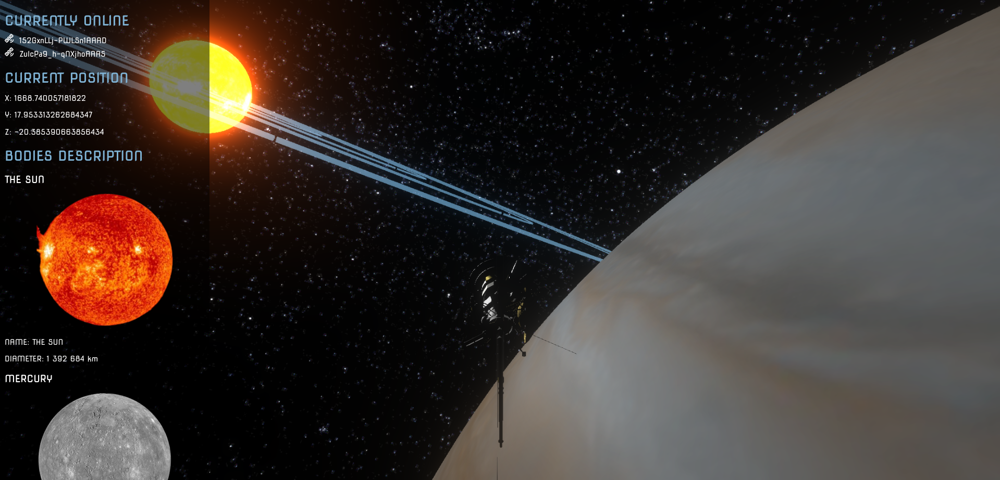

# SOLAR SYSTEM EXPLORER

*@authors: Cédric ABDELBAKI, Yanis KOUIDRI, Alban PERSONNAZ*

***

A 3D representation of the solar system using express, socket.io, Vue.js and Three.js.

## DESCRIPTION :

This program allows you to control the Cassini-Huygens probe
to explore the solar system alongside other explorers. A sidebar on the left side of the screen displays the connected clients identifiers, the current position and a description with a picture of each celestial bodies.

## HOW TO RUN :

- `npm init es6`
- `npm install express socket.io`
- `node server/App.js`
- localhost:3000 on a web browser

## CONTROLS :

- **Z**/**Q**/**S**/**D** to move forwards, left, backwards, right
- **A**/**E** to roll left and right
- Drag to look with mouse left button
- Scroll through the sidebar with mouse wheel

## ASSETS :

All planets textures were downloaded from the https://www.solarsystemscope.com/ website.
The Cassini-Huyguens 3D model was downloaded from uperesito's sketchfab page : https://sketchfab.com/uperesito.
Pictures in the sidebar are from NASA websites. The Satellite icon was downloaded from the https://fonts.google.com/icons website.

